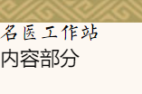

目前整理整合：背景图片铺满和模糊、滚动条、四周阴影、旋转

<!-- more -->

# 背景图片铺满和模糊

背景图片不变形铺满容器且不变形

```html
<div class="bg">
  <div class="content">Hi!</div>
</div>
```

css 样式

```css
* {
  padding: 0;
  margin: 0;
}
html,
body {
  width: 100%;
  height: 100%;
}
.bg {
  width: 100%;
  height: 100%;
  background: url(../img/bg.jpg);
  /* 背景图片居中 */
  background-position: center center;
  /* 背景图片铺满不变形 */
  background-size: cover;
}
/* 被选元素的内容后面插入内容,模糊效果 */
.bg::after {
  /* 显示内容 */
  content: "";
  width: 100%;
  height: 100%;
  position: absolute;
  /* 继承 */
  background: inherit;
  /* 模糊程度 */
  filter: blur(2px);
  /* 元素的堆叠顺序 */
  z-index: 1;
}
.content {
  /* 字体及背景样式 */
  width: 50px;
  height: 80px;
  color: rgb(0, 0, 0);
  font-size: 30px;
  font-weight: bold;
  text-align: center;
  line-height: 80px;
  background-color: #d5e8f6;
  border-left: 1px solid #000;
  /* 居中 */
  position: absolute;
  left: 50%;
  top: 50%;
  transform: translate(-50%, -50%);
  /* 元素的堆叠顺序 */
  z-index: 2;
}
```

# 滚动条

```css
.content {
  /* 多余内容以滚动条形式显示 */
  overflow: auto;
  /* 显示y轴滚动条 */
  overflow-y: scroll;
}
/* 修改滚动条样式 */
.content::-webkit-scrollbar {
  width: 4px;
}
.content::-webkit-scrollbar-thumb {
  border-radius: 10px;
  -webkit-box-shadow: inset 0 0 5px rgba(41, 39, 39, 0.2);
  background: rgba(255, 255, 255, 0.3);
}
.content::-webkit-scrollbar-track {
  -webkit-box-shadow: inset 0 0 5px rgba(0, 0, 0, 0.2);
  border-radius: 0;
  background: rgba(34, 34, 34, 0.1);
}
```

滚动条属性

> ::-webkit-scrollbar 滚动条整体部分，可以设置宽度啥的
> ::-webkit-scrollbar-button 滚动条两端的按钮
> ::-webkit-scrollbar-track 外层轨道
> ::-webkit-scrollbar-track-piece 内层滚动槽
> ::-webkit-scrollbar-thumb 滚动的滑块
> ::-webkit-scrollbar-corner 边角
> ::-webkit-resizer 定义右下角拖动块的样式

[参考链接](https://segmentfault.com/a/1190000012800450)

# 四周阴影

外阴影

```css
/* 阴影颜色 x轴 y轴 模糊半径 扩展半径 */
box-shadow: darkgrey 0px 0px 8px 3px;
```

内阴影

```css
/* 阴影颜色 x轴 y轴 模糊半径 扩展半径 内阴影*/
box-shadow: darkgrey 0px 0px 8px 3px inset;
```

## 三个方向的阴影

```
box-shadow: -5px -5px 10px rgba(0, 0, 0, 0.3),
            5px -5px 10px rgba(0, 0, 0, 0.3),
            -5px 5px 10px rgba(0, 0, 0, 0.3);
```


# 旋转

模拟方向盘旋转

html、js

```html
</img>
  <script>
    function changeSteer(value){
      document.getElementById("steer_img").style.transform = "rotate(" + value + "deg)";
    }
    changeSteer(-90)
  </script>
```

css

```css
#steer_img {
  transform: rotate(90deg);
  transition: all 1s;
}
```

# animate


```
npm install animate.css --save
```

main.ts

```typescript
import animate from 'animate.css'

const app = createApp(App)

for (const [key, component] of Object.entries(ElementPlusIconsVue)) {
  app.component(key, component)
}

app.use(pinia).use(router).use(ElementPlus).use(animate).mount('#app')

```


# 字体

全局css文件

```scss
@font-face {
  font-family: 'LGQ'; //重命名字体名
  src: url('../assets/font/柳公权柳体.ttf'); //引入字体
  font-weight: normal;
  font-style: normal;
}

@font-face {
  font-family: 'HYFS'; //重命名字体名
  src: url('../assets/font/汉仪仿宋S.ttf'); //引入字体
  font-weight: normal;
  font-style: normal;
}

```

使用

```scss
  .titlt {
    font-family: LGQ;
  }
```



# 文字

## p标签不换行

```css
p{
	white-space: normal;
}
```

## 省略号显示

```css
// 超出两行显示省略号
overflow: hidden;
text-overflow: ellipsis;
display: -webkit-box;
-webkit-box-orient: vertical;
-webkit-line-clamp: 5;
```

## 缩进

```css
// 首行缩进两个字符
text-indent: 2em;
```


## 方向

```css
// 从左到右水平流动，从上到下垂直流动
writing-mode: horizontal-tb;
// 从上到下垂直流动，从右到左水平流动。
writing-mode: vertical-rl;
// 从上到下垂直流动，从左到右水平流动。
writing-mode: vertical-lr;
```


## 间距

```css
letter-spacing: 5px;
```

## 阴影

```css
text-shadow: 0.1em 0.1em 0.05em #333
```

# 编辑器

vue3 文档：https://packy-tang.gitee.io/vue-tinymce/#/

参考：https://blog.csdn.net/mrjimin/article/details/121648927

```
npm install --save "@tinymce/tinymce-vue@^4"
```


# 公共函数

`src\utils\fun.ts`

```typescript
/**
 * 是否为空
 * @param val 判断值
 */
export function isEmpty(val: any) {
  if (typeof val !== 'undefined' && val !== null && val !== '') {
    return true
  }
  return false
}

/**
 * 文章栏目遍历
 * @param data 数据
 */
export function handleTreeData(data: Array<Object>) {
  data.forEach((e) => {
    e.label = e.name
    e.value = e.id
    if (e.children) {
      handleTreeData(e.children)
    }
  })
}

/**
 * @description 判断数据类型
 * @param val 需要判断类型的数据
 * @returns {string} 数据类型
 */
export function isType(val: any) {
  if (val === null) return 'null'
  if (typeof val !== 'object') return typeof val
  else
    return Object.prototype.toString.call(val).slice(8, -1).toLocaleLowerCase()
}

/**
 * @description 对象数组深克隆
 * @param obj 源对象
 * @returns {obj} 克隆后的对象
 */
export function deepCopy<T>(obj: any): T {
  let newObj: any
  try {
    newObj = obj.push ? [] : {}
  } catch (error) {
    newObj = {}
  }
  for (let attr in obj) {
    if (typeof obj[attr] === 'object') {
      newObj[attr] = deepCopy(obj[attr])
    } else {
      newObj[attr] = obj[attr]
    }
  }
  return newObj
}

/**
 * @description 获取localStorage
 * @param key Storage名称
 * @returns {String} Storage值
 */
export function localGet(key: string) {
  const value = window.localStorage.getItem(key)
  try {
    return JSON.parse(window.localStorage.getItem(key) as string)
  } catch (error) {
    return value
  }
}

/**
 * @description 存储localStorage
 * @param key Storage名称
 * @param value Storage值
 */
export function localSet(key: string, value: any) {
  window.localStorage.setItem(key, JSON.stringify(value))
}

```


# 媒体查询

```
/* 在小于或等于 992 像素的屏幕上，将背景色设置为蓝色 */
@media screen and (max-width: 992px) {
  body {
    background-color: blue;
  }
}

/* 在 600 像素或更小的屏幕上，将背景色设置为橄榄色 */
@media screen and (max-width: 600px) {
  body {
    background-color: olive;
  }
}
// d
@media screen and (min-width: 1400px) {
    height: 400px;
  }
```


# 4个边框颜色不同

border-top-color、border-bottom-color、border-left-color、border-right-color属性


# 四个不同圆角

- **四个值:** 第一个值为左上角，第二个值为右上角，第三个值为右下角，第四个值为左下角。
- **三个值:** 第一个值为左上角, 第二个值为右上角和左下角，第三个值为右下角
- **两个值:** 第一个值为左上角与右下角，第二个值为右上角与左下角
- **一个值：** 四个圆角值相同


# 透明度

```css
img {
  opacity: 0.5;
}
```

# Input

## placeholder颜色

```css
选中元素::input-placeholder{
	color:red;
}
```

