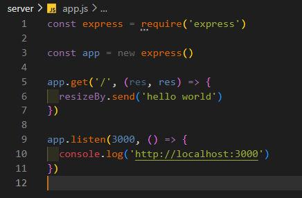
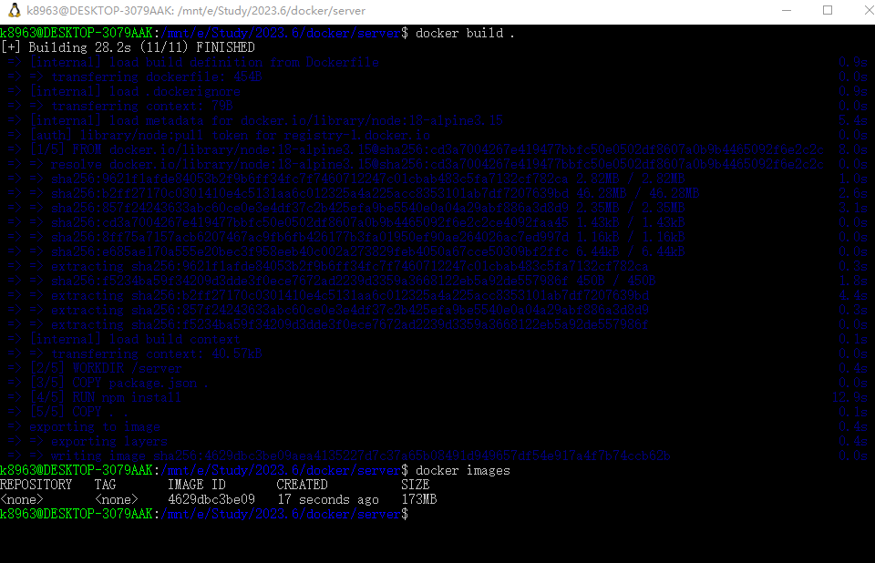
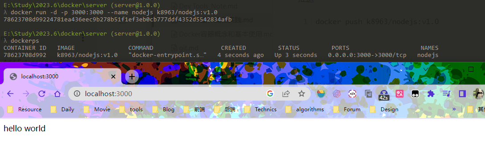

---
title:Docker工作流和实践
date:2021-11-18 23:10:00
comments:false
author:8963
tags:
  - Docker
  - 开发环境
categories:
  - 环境工具
---

Docker工作流和实践

<!-- more -->

环境：win10 WSL2

# 创建nodejs应用

引入express，创建一个简单的服务器



# Dockerfile

`Dockerfile`

```dockerfile
# 应用基础镜像
FROM node:18-alpine3.15
# 指定工作目录：容器内共目录下的server文件夹
WORKDIR /server
# 拷贝当前目录下的package.json到容器内工作目录中
COPY package.json .
# 安装依赖
RUN npm install
# 拷贝当前目录下的文件到容器内工作目录中
COPY . .
# 声明需要暴露的容器端口
EXPOSE 3000
# 启动服务
CMD [ "npm", "run", "start" ]
```

`.dockerignore` 忽略文件

```
node_modules
Dockerfile
.dockerignore
```


# 构建

在Dockerfile的当前目录里输入

```
docker build .
```

构建完成后可查看镜像：

```
docker images
```




# 推送到dockerhub

更名

```
docker tag 4692 k8963/nodejs:v1.0
```

> 名称格式：用户名/镜像名:版本
>
> 注意：这个用户名必须为dockerhub上注册的名称，否则会推送失败

先登录docker

```
docker login
```

推送

```
docker push k8963/nodejs:v1.0
```


# 运行

运行并查看

```
docker run -d -p 3000:3000 --name nodejs k8963/nodejs:v1.0
docker ps -a
```

运行成功



# 同步修改

将本地文件与容器文件进行绑定，这样修改本地文件时就可以同步

```
docker run -d -v 本地文件夹绝对路径:容器文件夹路径 -p 3000:3000 --name nodejs k8963/nodejs:v1.0 
```

启动

```
docker run -d -v E:\Study\2023.6\docker\server:/server -p 3000:3000 --name nodejs k8963/nodejs:v1.0 
```

但是`node_modules`不进行同步，需要声明

```
docker run -d -v E:\Study\2023.6\docker\server:/server:ro -v /server/node_modules -p 3000:3000 --name nodejs k8963/nodejs:v1.0
```

## 问题

还是没有办法同步


解决：

将启动命令修改为

```
nodemon -L app.js
```


这样就同步成功了
